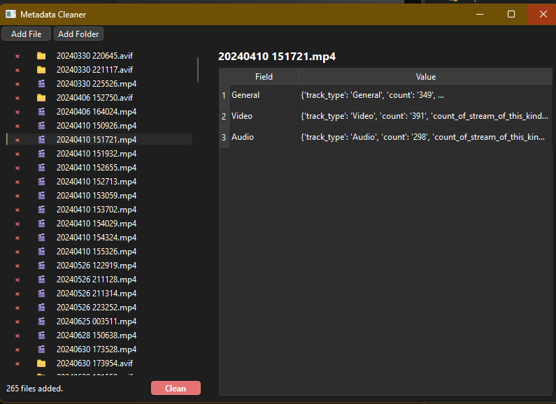

# 📄 Metadata Cleaner 🧹🔍



*A modern Python tool for quickly and securely cleaning metadata from image, document, audio, and video files.*

<sub>Screenshot: Modern and simple GUI for batch metadata cleaning</sub>

---

## 📌 Overview

**Metadata Cleaner** is a multi-format, parallel-processing command-line and GUI application developed for privacy, security, and data hygiene.

- **Protect your privacy:** Remove hidden metadata from files.
- **Batch processing:** Clean single files or entire folders/subfolders in bulk.
- **Selective filtering:** Use a JSON config to specify which metadata fields to keep.
- **Modern interface:** Simple and accessible GUI based on PySide6.
- **Fast:** Process multiple files without freezing the UI using ThreadPoolExecutor.
- **Wide format support:** Icons and metadata support for images, documents, audio, video, archives, and code files.
- **Logging:** Detailed logs to console and file.

---

## 🚀 Installation

### With pip (Recommended)
```bash
pip install -r requirements.txt
```

Then from the command line:
```bash
python src/cli.py --help
```

### With Poetry (Alternative)
```bash
git clone ...
cd metadata-cleaner
poetry install
poetry run python src/cli.py --help
```

---

## 🖥️ Usage Examples

### Clean a Single File
```bash
python src/cli.py --file path/to/photo.jpg
```

### Clean All Files in a Folder
```bash
python src/cli.py --folder path/to/folder
```

### With Subfolders and Custom Output
```bash
python src/cli.py --folder path/to/folder --recursive --output sanitized_files --yes
```

### Selective Cleaning with Config
```bash
python src/cli.py --file photo.jpg --config config.json
```

---

## 🧑‍💻 API Usage

### Core Functions

#### `remove_metadata(file_path: str, output_path: Optional[str] = None, config_file: Optional[str] = None) -> Optional[str]`
Cleans metadata from a single file. For images, selective filtering can be done with a config file.

#### `remove_metadata_from_folder(folder_path: str, output_folder: Optional[str] = None, config_file: Optional[str] = None, recursive: bool = False) -> List[str]`
Cleans metadata from all supported files in a folder. Use recursive=True for subfolders.

**Example:**
```python
from remover import remove_metadata, remove_metadata_from_folder
cleaned_file = remove_metadata("photo.jpg", config_file="config.json")
cleaned_files = remove_metadata_from_folder("my_folder", recursive=True)
```

### Handler Functions
```python
from file_handlers.image_handler import remove_image_metadata
from file_handlers.pdf_handler import remove_pdf_metadata
from file_handlers.docx_handler import remove_docx_metadata
from file_handlers.audio_handler import remove_audio_metadata
from file_handlers.video_handler import remove_video_metadata
```

---

## 📝 Features & Roadmap

### ✅ Completed
- Modern desktop interface with PySide6
- Batch/folder processing, parallel cleaning with ThreadPoolExecutor
- Modern format support (WEBP, HEIC, XLSX, PPTX, ODS, ODP, etc.)
- Detailed logging and error management

### ⏳ Planned
- Web-based GUI (Flask/FastAPI/Electron.js)
- Log rotation and advanced error reporting
- Auto-update feature
- New formats (EPUB, advanced archive support)

---

## 🪲 Logging & Error Management
- Logs are written to both the console and `logs/metadata_cleaner.log` file.
- Common errors:
  - **File Not Found:**  `File not found: <file_path>`
  - **Unsupported File Type:**  `Unsupported file type: <extension>`
  - **FFmpeg Error:**  For video file errors, ensure `ffmpeg/ffmpeg.exe` is present (comes with the project, no extra setup needed).

---

## 📂 Project Structure
```
metadata-cleaner/
├── src/
│   ├── cli.py                # CLI entry point
│   ├── gui_pyside.py         # PySide6 GUI
│   ├── remover.py            # Core cleaning logic
│   ├── config/               # Settings
│   ├── core/                 # Metadata filtering helpers
│   ├── file_handlers/        # File type handlers
│   └── logs/                 # Logging
├── ffmpeg/                   # Portable ffmpeg (for Windows)
├── requirements.txt          # Dependencies
├── README.md                 # This file
```

---

## 🏗️ Build & Distribution

### Windows (EXE)
- For GUI:
  ```
  scripts\build_gui.bat
  dist\MetadataCleanerGUI.exe
  ```
- For CLI:
  ```
  scripts\build_cli.bat
  dist\metadata-cleaner.exe
  ```

### Linux/Mac
- Setup venv and run with bash script:
  ```
  bash scripts/build.sh
  source .venv/bin/activate
  python src/gui_pyside.py
  # or
  python src/cli.py --help
  ```

---

## 🚀 Possible Features
- Light/dark theme support (GUI)
- Drag-and-drop file/folder addition
- Operation history and recently cleaned list
- Multi-language support (i18n)
- Log rotation and advanced error reporting
- More file formats (EPUB, archive, new media types)
- Auto-update
- CLI auto-completion
- File hash checking
- Web-based interface (Flask/FastAPI/Electron.js)
- More automated tests and CI/CD pipeline